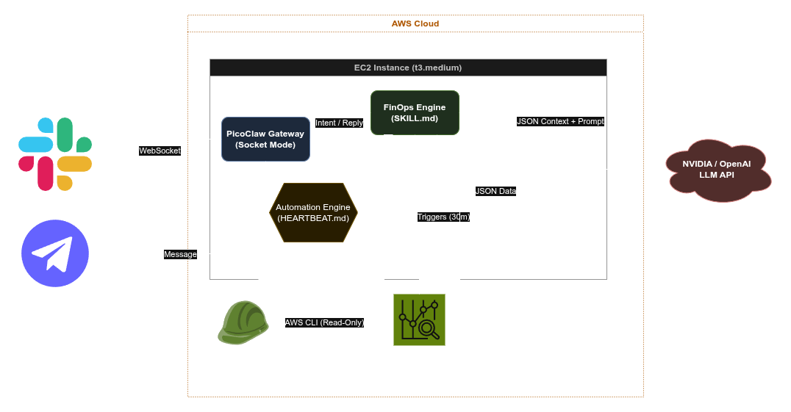

# PicoClaw FinOps Copilot Architecture

The system follows a distributed, event-driven design integrating natural language processing with strict, deterministic execution constraints on AWS.

## High-Level Diagram

### Request Flow

1.  **Slack (User Input):** The user mentions `@PicoClaw` or sends a direct message requesting cost data.
2.  **WebSocket Connection:** The message securely travels to the EC2 Instance running the `picoclaw gateway` via Slack Socket Mode.
3.  **FinOps Engine Processing:** PicoClaw maps the user's intent to the deterministic AWS CLI commands strictly defined inside `skills/finops/SKILL.md`.
4.  **AWS Execution:** The `aws` CLI executes the command.
    *   Authentication is seamlessly handled by the EC2 Instance's attached **IAM Role / Instance Profile**.
    *   The `iam-policy.json` guarantees read-only Cost Explorer and CloudWatch operations unless explicitly granted otherwise.
5.  **LLM Consolidation:** The raw JSON output from AWS Cost Explorer is sent to the designated LLM Provider (NVIDIA, OpenAI, Anthropic) alongside strict formatting prompts.
6.  **Response Delivery:** The structured, plain-language summary is returned to the user via the Slack WebSocket.

### Sub-systems

#### Automation Engine
Powered by the internal `HEARTBEAT.md` configuration, PicoClaw can execute cron-style tasks internally. It follows the exact same execution model (Engine -> EC2 IAM -> LLM), but pushes alerts into channels without requiring human triggering.

#### Workspace Isolation
All file activities logic-parsing happens within the isolated `~/.picoclaw/workspace`, ensuring the raw Linux system is safe from side-effects unless explicitly granted via skill definition logic.
