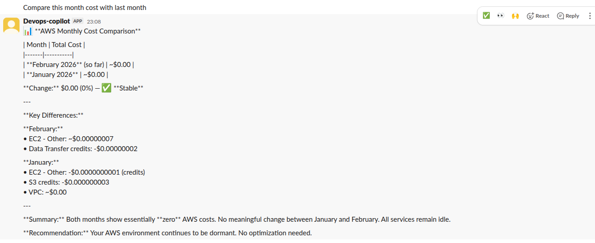
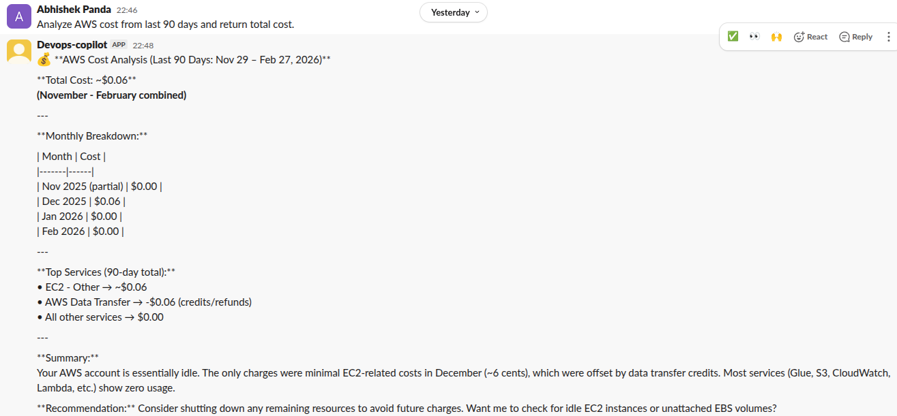
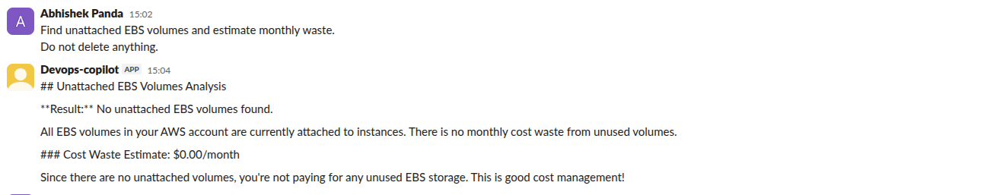
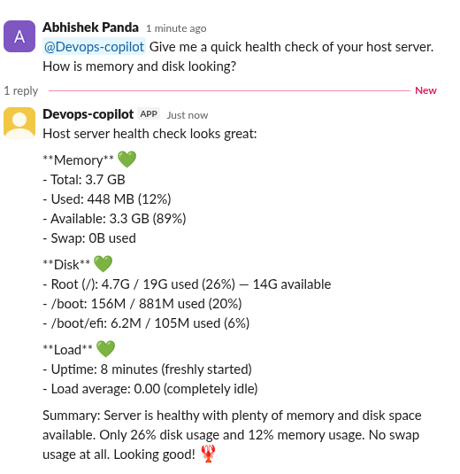
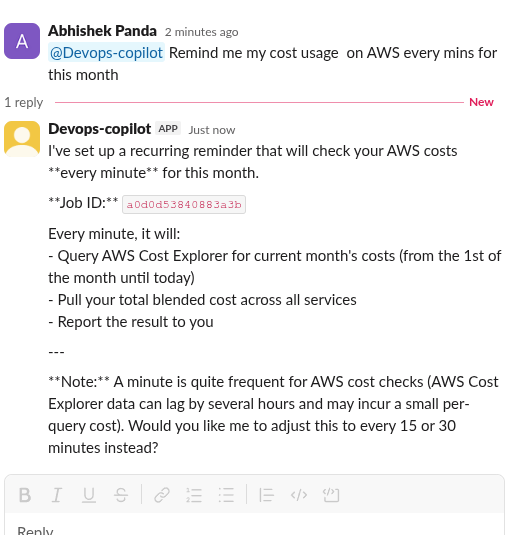

# PicoClaw FinOps Copilot

[](https://opensource.org/licenses/MIT)
[](https://aws.amazon.com/)
[](https://www.terraform.io/)
[](https://slack.com)
[](https://telegram.org)

> Enterprise-grade AIOps & LLMOps automation agent built for DevOps teams.

PicoClaw FinOps Copilot is a Slack-native, AI-assisted cloud cost intelligence platform that integrates AWS Cost Explorer with deterministic cost analysis and LLM-based executive reporting.

It bridges the gap between **DevOps**, **FinOps**, **LLMOps**, and **AIOps** by helping engineering teams:

- Compare monthly cloud spend
- Detect cost anomalies and idle resources
- Automate scheduled reports
- Explain cost changes in plain language
- Operate securely using IAM roles (no static credentials)

---

# Architecture


### Core Design Principle

- 🔒 **Numbers are deterministic** (computed via AWS SDK)
- 🧠 **AI is used only for explanation and summarization**

This prevents hallucination and ensures financial accuracy.

---

# ✨ Features & Installed Skills

## 💰 FinOps Skill (`skills/finops`)
This repository comes with a built-in AWS FinOps skill for PicoClaw, allowing it to act as your autonomous cost analyst.

**Capabilities:**
- **Cost Summary / Service Breakdown:** Get top 5 service costs for any time range (e.g., "last 7 days").
- **Monthly Cost Comparison:** Compare current month spend vs previous month spend with percentage change highlighting.
- **Idle Resource Detection:** Finds unused EBS volumes (`available` state), calculates monthly waste, and offers cleanup assistance safely.

## Alerts & Monitoring
- Daily cost summary
- Service-level cost spike detection
- Weekly executive report

## AI-Enhanced Insights
- Plain-language explanations of cost increases
- Slack-friendly formatting (no massive raw JSON dumps)
- Safe read-only executions (destructions require explicit user confirmation)

## 🔐 Security-First Design

- IAM Role-based authentication
- No AWS access keys stored
- Read-only Cost Explorer access
- No destructive operations without approval
- Slack token-based access control

---

# Requirements

- Ubuntu EC2 instance (or compatible Linux server)
- IAM Role with Cost Explorer permissions
- AWS CLI v2 installed
- Slack App (Socket Mode enabled)
- NVIDIA-hosted LLM (or compatible OpenAI-style endpoint)
- PicoClaw installed

---

# Quick Start

## Prerequisites
To launch the automated Terraform deployment, please refer to the complete deployment guide located at [`deploy/README.md`](deploy/README.md).

**Security Note:** Do not hardcode any AWS credentials! The deployment provisions an EC2 instance with an attached **IAM Role** so the agent can run securely using inherited permissions.

## Attach IAM Role to EC2

Minimum required permissions:

- `ce:GetCostAndUsage`
- `ec2:DescribeInstances`
- `ec2:DescribeVolumes`
- `sts:GetCallerIdentity`

Verify:

```bash
aws sts get-caller-identity
```

---

## Configure PicoClaw

Update `~/.picoclaw/config.json`:

```json
{
  "agents": {
    "defaults": {
      "provider": "moonshot",
      "model": "moonshotai/kimi-k2.5"
    }
  }
}
```

Enable Slack channel:

```json
"slack": {
  "enabled": true,
  "bot_token": "xoxb-...",
  "app_token": "xapp-...",
  "allow_from": []
}
```

Enable Telegram channel (Alternative):

```json
"telegram": {
  "enabled": true,
  "bot_token": "123456:ABC-DEF1234ghIkl-zyx57W2v1u123ew11",
  "allow_from": ["123456789"]
}
```

---

## 3️⃣ Start Gateway

```bash
picoclaw gateway
```

Health endpoints available:

```
http://127.0.0.1:18790/health
http://127.0.0.1:18790/ready
```

# 💬 Example Slack / Telegram Commands

Here are examples of what the FinOps Copilot outputs when you ask it for cost data in Slack or Telegram:

### Monthly Comparison



### Service Breakdown History



### Idle Resource Detection



### System Health Monitoring



### Custom Scheduling



---

# 📅 Automation Capabilities

| Automation | Description |
|------------|-------------|
| Daily Cost Summary | 9 AM automated report |
| Budget Alert | Notify when spend exceeds threshold |
| Weekly Executive Report | Slack-ready cost summary |
| Anomaly Detection | Detect sudden cost spikes |
| Waste Detection | Identify idle resources |

---

# 📈 Roadmap

| Phase | Capability | Status |
|-------|------------|--------|
| Phase 1 | Slack FinOps Integration | ✅ |
| Phase 2 | Deterministic Cost Engine | 🚧 |
| Phase 3 | Automated Alerts | 🚧 |
| Phase 4 | Anomaly Detection | ⏳ |
| Phase 5 | Autonomous Optimization | ⏳ |

Full roadmap available in `ROADMAP.md`.

---

# 🔐 Security Model

- IAM Role only (no stored AWS keys)
- Read-only billing access
- Slack event filtering
- No destructive changes without confirmation
- Workspace execution isolation
- Audit logging enabled

---

# 🧪 Production Hardening

Planned enhancements:

- AWS SDK integration (remove CLI dependency)
- Multi-account AWS Organizations support
- Slack approval workflow
- Terraform auto-deployment
- CI pipeline with lint + security scan
- Structured JSON logging
- Event deduplication guard

---

# 🏆 Why This Project Matters

Most DevOps teams lack:

- Real-time cost visibility
- Slack-integrated FinOps tooling
- Automated anomaly detection
- AI-assisted cost explanations

This project bridges:

- DevOps
- FinOps
- LLMOps
- Cloud Automation

It demonstrates real-world distributed systems engineering combined with AI orchestration.

---

# 🧭 Long-Term Vision

Build a fully autonomous cloud FinOps engineer that:

- Continuously monitors AWS spend
- Detects waste automatically
- Explains cost shifts clearly
- Suggests optimizations
- Operates safely under IAM constraints
- Integrates natively with team workflows

---

# 📜 License

MIT License

---
